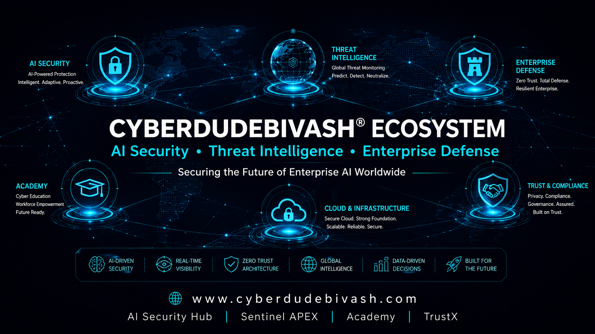

# CYBERDUDEBIVASH® ECOSYSTEM



**Official global command center for the CYBERDUDEBIVASH® ecosystem — platform registry, public relations, digital marketing, campaign operations, launch coordination, ecosystem health, and growth intelligence.**

> **Mission:** increase qualified global visibility, trust, adoption, and commercial opportunity across the complete CYBERDUDEBIVASH® ecosystem without compromising security, accuracy, brand integrity, or customer trust.

## Ecosystem

| Platform | Purpose | Canonical URL |
|---|---|---|
| Official Portal | Corporate and ecosystem gateway | https://www.cyberdudebivash.com/ |
| AI Security Hub | AI-native security, governance and enterprise defense | https://cyberdudebivash.in/ |
| Sentinel APEX | Threat intelligence and security intelligence | https://intel.cyberdudebivash.com/ |
| CTI Platform | Cyber threat intelligence experience | https://cti.cyberdudebivash.in/ |
| Intelligence Factory | Intelligence publications and research | https://blog.cyberdudebivash.in/ |
| Sentinel APEX Academy | Cybersecurity and AI security education | https://academy.cyberdudebivash.com/ |
| TrustX | Trust, privacy, governance and compliance | https://trustx.cyberdudebivash.com/ |
| Tools Store | Commercial security tools and professional toolkits | https://tools.cyberdudebivash.com/ |

## Global Public Directory

The ecosystem maintains a governed public directory for campaign generation, PR, customer discovery, media references, APIs, social channels and public repositories:

- **Human-readable directory:** [`docs/PUBLIC-DIRECTORY.md`](docs/PUBLIC-DIRECTORY.md)
- **Machine-readable directory:** [`config/public-directory.json`](config/public-directory.json)
- **Public directory validation:** `python scripts/validate_public_directory.py`

**Official contact:** `contact@cyberdudebivash.in` · `bivash@cyberdudebivash.com` · `+91 8179881447`  
**Location:** Odisha, India · **Service scope:** Global

Public campaign capability tags: **AI Security · Threat Intelligence · SOC · MSSP · Cloud Security · Zero Trust · Enterprise Cyber Defense**.

## What this repository does

This repository operates as the ecosystem's **PR & Digital Marketing Agent control plane**. It provides:

- a canonical, machine-readable platform registry;
- a governed public directory for platforms, APIs, channels and public repositories;
- brand and messaging governance;
- automated platform-health intelligence;
- repeatable global campaign generation;
- launch, product, research, academy and threat-intelligence promotion playbooks;
- PR opportunity and campaign issue workflows;
- measurable growth and distribution governance;
- reusable briefs for LinkedIn, X, YouTube, blogs, newsletters, partner outreach and executive communications;
- security and factual-accuracy quality gates before publication.

## Agent operating model

The agent follows a strict **evidence → message → channel → measurement → learning** loop:

1. **Observe** — platform status, launches, new reports, releases, publications and strategic priorities.
2. **Prioritize** — select the highest-value story by relevance, authority, commercial impact and timeliness.
3. **Package** — generate an audience-specific campaign brief with canonical claims and URLs.
4. **Review** — enforce brand, factual, security, legal and reputational gates.
5. **Distribute** — prepare channel-ready content and publishing instructions.
6. **Measure** — track reach, qualified traffic, conversions, leads, citations and platform adoption.
7. **Improve** — convert results into the next campaign hypothesis and backlog.

**Direct social posting is intentionally not enabled by default.** Publishing to external networks requires explicit API integrations, scoped credentials, rate-limit handling, approval policy and channel-specific compliance.

## Campaign Intelligence Engine v2

The repository now includes a controlled intelligence-to-campaign pipeline that monitors approved first-party intelligence feeds and public GitHub release sources, normalizes heterogeneous signals, scores PR/marketing opportunities, deduplicates them with deterministic fingerprints, and opens only high-confidence GitHub issues for analyst review.

**Production controls:**

- explicit source trust and hostname allowlists;
- bounded HTTP timeouts and response sizes;
- six-dimensional 0–5 opportunity scoring;
- evidence, freshness and total-score hard gates;
- maximum five new campaign-intelligence issues per run;
- cross-run deduplication through SHA-256 signal fingerprints;
- all-source-failure workflow protection;
- no direct external publication.

See [`docs/CAMPAIGN-INTELLIGENCE.md`](docs/CAMPAIGN-INTELLIGENCE.md).

## Public-Claim Safety

Payment identifiers, credentials, PAN data, tax/compliance identifiers, customer-private data, and unverified market-leadership claims do not belong in the public marketing registry. Legal/compliance assertions and superlatives must pass evidence review before being promoted globally.

## Quick start

```bash
python scripts/validate_registry.py
python scripts/validate_public_directory.py
python scripts/validate_intelligence_config.py
python scripts/health_audit.py --output reports/platform-health.md
python scripts/generate_campaign.py --platform all --objective authority --output reports/campaign-brief.md
python scripts/intelligence_engine.py --output-json reports/opportunities.json --output-markdown reports/campaign-intelligence.md
python -m unittest discover -s tests -v
```

## Automation

- **Platform Health:** scheduled ecosystem availability audit with a GitHub issue on degradation.
- **Weekly Campaign Engine:** generates a campaign brief and opens a structured campaign issue.
- **Campaign Intelligence Engine v2:** twice-daily trusted-source collection, scoring, deduplication and analyst-review opportunity creation.
- **Repository Quality:** validates the platform registry, public directory and campaign engine on every pull request.

See [`docs/ARCHITECTURE.md`](docs/ARCHITECTURE.md), [`docs/GOVERNANCE.md`](docs/GOVERNANCE.md), [`docs/MEASUREMENT.md`](docs/MEASUREMENT.md), [`docs/PUBLIC-DIRECTORY.md`](docs/PUBLIC-DIRECTORY.md), and [`docs/CAMPAIGN-INTELLIGENCE.md`](docs/CAMPAIGN-INTELLIGENCE.md).

## Brand authority

**CYBERDUDEBIVASH®**  
AI Security • Threat Intelligence • Enterprise Defense  
https://www.cyberdudebivash.com/

---

Copyright © CYBERDUDEBIVASH®. All rights reserved. Brand names, marks, content and commercial assets remain subject to their respective ownership and usage terms.
